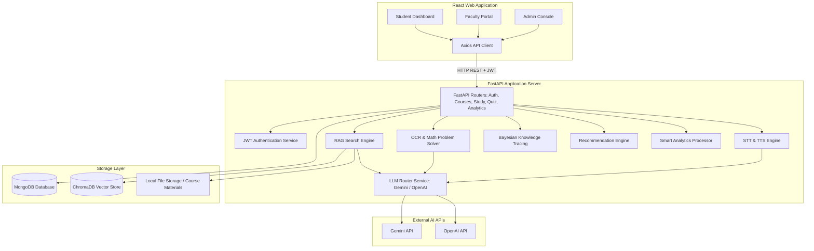

# Architecture Design Document - Virtual AI Tutor

This document details the high-level architecture, component communication, and data flows of the **Virtual AI Tutor** platform.

## High-Level Architecture Diagram

---

## Component Details

### 1. React Frontend
- **Framework**: Vite-based React application written in Javascript.
- **Styling**: Tailwind CSS for responsive and modern dashboards.
- **Visualizations**: Chart.js and custom components for learning dashboards, progress charts, and performance tracking.
- **API Client**: Axios wrapper with interceptors to automatically inject the Bearer JWT token from local storage.

### 2. FastAPI Backend
- **Framework**: FastAPI (asynchronous ASGI framework).
- **ODM / Database Client**: Motor (async MongoDB driver for Python).
- **Authentication**: JWT token-based auth with bcrypt hashed passwords.
- **Services Layout**:
  - `auth_service.py`: Password hashing, verification, token encoding/decoding.
  - `llm_service.py`: Unified API wrapper to execute LLM queries using Gemini or OpenAI.
  - `rag_service.py`: PDF/text processing, chunking (fixed size overlap), embedding generation, vector query, and prompt injection.
  - `ocr_service.py`: Image preprocessing, local text/math formula extraction via `easyocr`, and LLM-assisted diagram reasoning.
  - `voice_service.py`: Speech-to-Text conversion and Text-to-Speech audio file generation using `gtts`.
  - `knowledge_tracing.py`: Implementation of Bayesian Knowledge Tracing (BKT) to update learner mastery probabilities after each quiz submission.
  - `recommendation.py`: Algorithmic engine that returns the next optimal lessons, quizzes, and practice tasks.
  - `analytics_service.py`: Real-time calculation of statistics (daily study time, improvements, exam readiness estimation).

### 3. Storage Layer
- **MongoDB**: Primary transactional database. Stores student profiles, courses, material records, quizzes, exam papers, attempts, tracking events, and study plans.
- **ChromaDB**: Native vector database running in-process. Stores document chunks and high-dimensional embeddings for RAG-based context injection.
- **Filesystem**: Local directory storage for raw uploaded PDFs, presentations, and audio files.

---

## Core AI & Data Pipelines

### A. Document Intelligence (RAG Pipeline)
1. **Upload**: Student or faculty uploads a PDF, DOCX, or PPTX.
2. **Text Extraction**: The document parser extracts text page-by-page.
3. **Chunking**: Text is split into overlapping chunks (e.g., 500 characters with 100 character overlap).
4. **Vector Ingestion**: Chunks are embedded using `sentence-transformers` (or Gemini/OpenAI embeddings) and stored in ChromaDB with metadata (document ID, course ID, page number).
5. **Retrieval**: When a student asks a question, ChromaDB queries for top-$k$ relevant chunks.
6. **Augmented Prompt**: The system injects these chunks and the source citations into the LLM prompt.
7. **Response**: LLM produces the final explanation, quoting sources.

### B. Image-based Learning (OCR & Diagram Solver)
1. **Upload**: Student uploads an image of a math problem or handwritten note.
2. **Local OCR**: EasyOCR reads text coordinates and math symbols.
3. **Multimodal API Fallback**: If local OCR is ambiguous or there is a complex diagram, the image is passed directly to the Gemini API (which handles image inputs natively).
4. **AI Solver**: The LLM parses the question, formulates a step-by-step mathematical explanation, and renders the output (supporting LaTeX formatting).

### C. Voice Interaction
1. **Speech Input**: Student records voice in React. Audio is sent as a `multipart/form-data` file.
2. **STT Processing**: The backend transcribes the audio using a transcription library (e.g. Whisper API or speech_recognition).
3. **AI Response**: The transcribed text is sent to the LLM agent.
4. **TTS Processing**: The text response is synthesized into an MP3 file using `gTTS` and returned to the client to play back.
