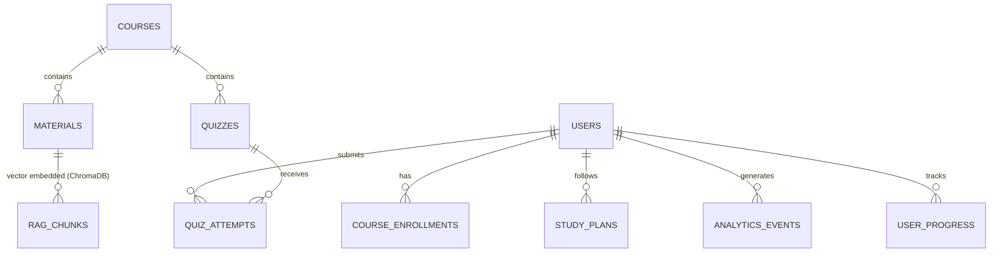

# MongoDB Data Models - Virtual AI Tutor

This document details the MongoDB collection schemas, key fields, relationships, and index specifications used in the platform.

## Collections Overview



---

## Detailed Collections

### 1. `users`
Stores student, faculty, and admin records.

```json
{
  "_id": "ObjectId",
  "name": "String",
  "email": "String (Unique)",
  "password_hash": "String",
  "role": "String (student | faculty | admin)",
  "created_at": "ISODate",
  "profile": {
    "avatar": "String",
    "bio": "String",
    "preferences": {
      "language": "String (default: en)",
      "theme": "String (light | dark)"
    }
  }
}
```
**Indexes**:
- Unique index on `email` (`{ "email": 1 }, { "unique": true }`)

---

### 2. `courses`
Courses created by faculty or admins.

```json
{
  "_id": "ObjectId",
  "title": "String",
  "description": "String",
  "subject": "String",
  "created_by": "ObjectId (users.id, role: faculty|admin)",
  "created_at": "ISODate",
  "students_enrolled": ["ObjectId (users.id)"]
}
```
**Indexes**:
- Index on `created_by` (`{ "created_by": 1 }`)
- Index on `subject` (`{ "subject": 1 }`)

---

### 3. `materials`
Course lecture notes, PDFs, DOCX, or images uploaded by faculty or students.

```json
{
  "_id": "ObjectId",
  "course_id": "ObjectId (courses.id)",
  "title": "String",
  "type": "String (pdf | pptx | docx | text | image)",
  "file_path": "String (local file path)",
  "uploaded_by": "ObjectId (users.id)",
  "uploaded_at": "ISODate",
  "summary": "String (concise AI-generated summary)",
  "vector_status": "String (pending | processed | failed)"
}
```
**Indexes**:
- Index on `course_id` (`{ "course_id": 1 }`)
- Index on `uploaded_by` (`{ "uploaded_by": 1 }`)

---

### 4. `rag_queries`
Logs student doubt-solving queries and the references/sources used by the RAG system.

```json
{
  "_id": "ObjectId",
  "student_id": "ObjectId (users.id)",
  "course_id": "ObjectId (courses.id)",
  "query": "String",
  "response": "String",
  "citations": [
    {
      "material_id": "ObjectId (materials.id)",
      "page_number": "Int",
      "snippet": "String"
    }
  ],
  "timestamp": "ISODate"
}
```
**Indexes**:
- Compound index on student and course (`{ "student_id": 1, "course_id": 1 }`)

---

### 5. `quizzes`
AI-generated or faculty-created quiz templates.

```json
{
  "_id": "ObjectId",
  "course_id": "ObjectId (courses.id)",
  "topic": "String",
  "difficulty": "String (easy | medium | hard)",
  "created_by": "String (ai | ObjectId)",
  "created_at": "ISODate",
  "questions": [
    {
      "id": "String (uuid)",
      "type": "String (mcq | short | coding)",
      "question_text": "String",
      "options": ["String"], // For MCQs
      "correct_answer": "String", // Correct choice index or correct text/regex
      "test_cases": [ // For coding practice
        {
          "input": "String",
          "output": "String"
        }
      ],
      "points": "Int"
    }
  ]
}
```
**Indexes**:
- Compound index (`{ "course_id": 1, "topic": 1 }`)

---

### 6. `quiz_attempts`
Records of student quiz submissions and grading.

```json
{
  "_id": "ObjectId",
  "quiz_id": "ObjectId (quizzes.id)",
  "student_id": "ObjectId (users.id)",
  "attempted_at": "ISODate",
  "answers": [
    {
      "question_id": "String",
      "submitted_answer": "String",
      "is_correct": "Boolean",
      "score_obtained": "Float",
      "feedback": "String" // AI-generated feedback
    }
  ],
  "total_score": "Float",
  "max_score": "Float",
  "accuracy_rate": "Float (0.0 to 1.0)",
  "time_taken_seconds": "Int"
}
```
**Indexes**:
- Compound index (`{ "student_id": 1, "quiz_id": 1 }`)

---

### 7. `user_progress`
Stores concept mastery using Bayesian Knowledge Tracing (BKT) parameter updates.

```json
{
  "_id": "ObjectId",
  "student_id": "ObjectId (users.id)",
  "course_id": "ObjectId (courses.id)",
  "topics": {
    "topic_name_1": {
      "mastery_probability": "Float (0.0 to 1.0)", // P(L) in BKT
      "quizzes_taken": "Int",
      "last_updated": "ISODate"
    },
    "topic_name_2": {
      "mastery_probability": "Float",
      "quizzes_taken": "Int",
      "last_updated": "ISODate"
    }
  },
  "overall_accuracy": "Float",
  "weak_areas": ["String"],
  "learning_speed": "Float (relative index based on progress speed)"
}
```
**Indexes**:
- Compound unique index (`{ "student_id": 1, "course_id": 1 }`, { "unique": true })

---

### 8. `study_plans`
Daily personalized schedule and study planner.

```json
{
  "_id": "ObjectId",
  "student_id": "ObjectId (users.id)",
  "course_id": "ObjectId (courses.id)",
  "date": "String (YYYY-MM-DD)",
  "tasks": [
    {
      "task_id": "String (uuid)",
      "description": "String",
      "topic": "String",
      "allocated_minutes": "Int",
      "completed": "Boolean",
      "recommended_material": "ObjectId (materials.id)"
    }
  ],
  "daily_study_time_seconds": "Int",
  "completed_at": "ISODate"
}
```
**Indexes**:
- Compound unique index (`{ "student_id": 1, "date": 1 }`)

---

### 9. `analytics_events`
Audit logs of user interactions (time spent studying, pages accessed) to feed visual analytics.

```json
{
  "_id": "ObjectId",
  "user_id": "ObjectId (users.id)",
  "event_type": "String (page_view | study_session | upload | quiz_start | question_solved)",
  "metadata": "Document (event-specific data, e.g., duration, course_id)",
  "timestamp": "ISODate"
}
```
**Indexes**:
- Index on `user_id` (`{ "user_id": 1 }`)
- Index on `timestamp` (`{ "timestamp": -1 }`)
